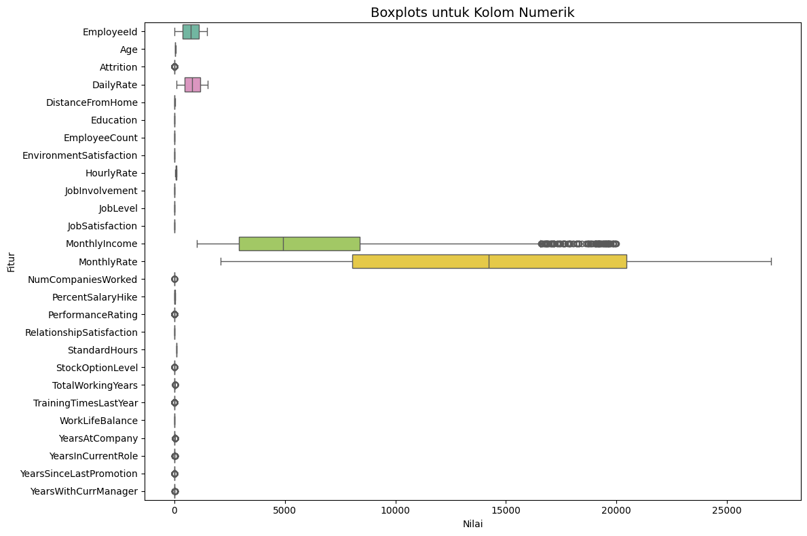
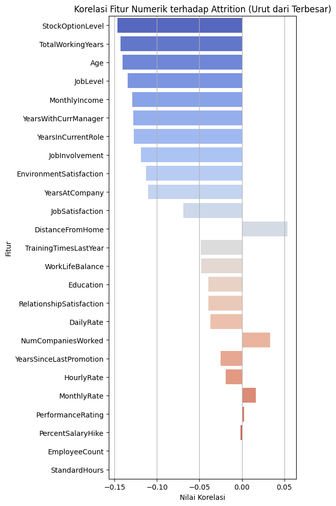
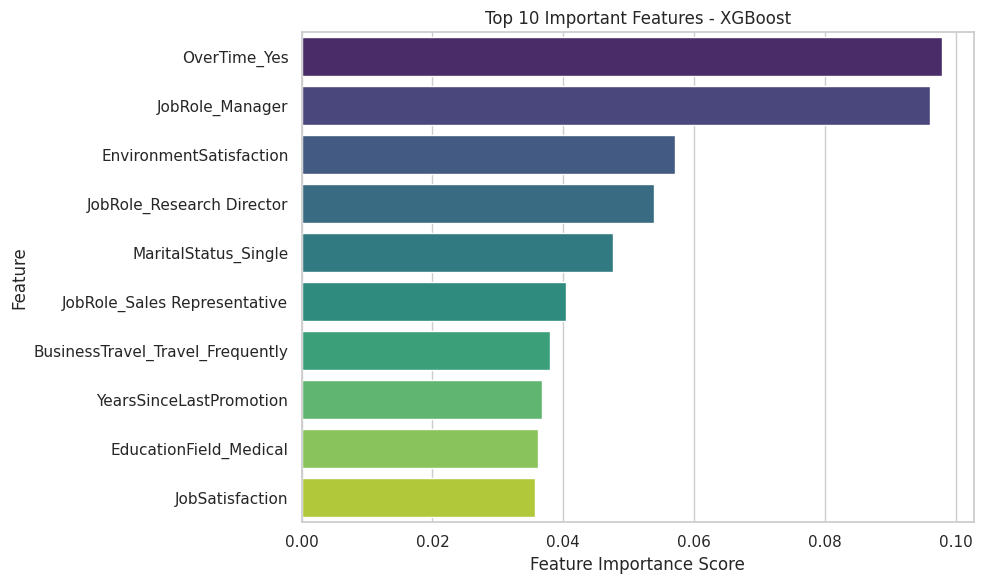
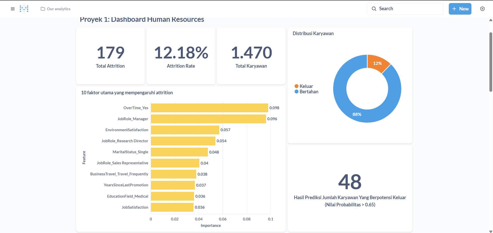
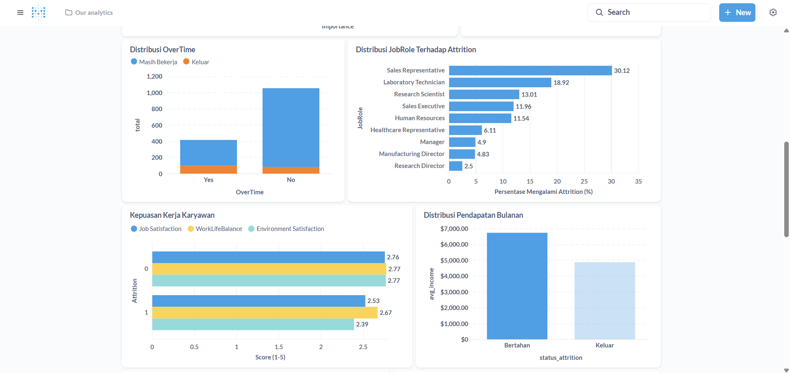
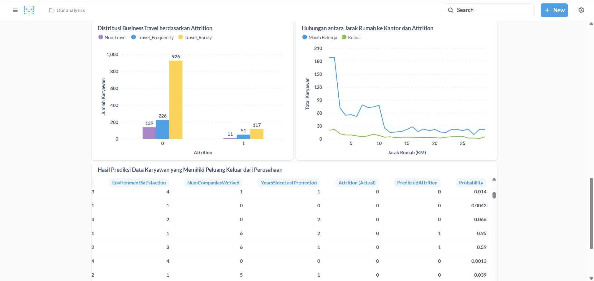

# Proyek Akhir: Menyelesaikan Permasalahan Perusahaan Edutech

## Business Understanding

Sejak berdiri pada tahun 2000, perusahaan multinasional Jaya Jaya Maju kini dihadapkan pada masalah signifikan dalam pengelolaan sumber daya manusia. Dengan lebih dari 1000 karyawan yang tersebar di seluruh Indonesia, perusahaan ini mencatat angka attrition rate di atas 10%, sebuah angka yang dianggap tinggi untuk ukuran perusahaan sebesar ini.Tingginya tingkat karyawan yang keluar ini tidak hanya mengindikasikan potensi isu internal terkait kepuasan dan kesejahteraan karyawan, tetapi juga berpotensi mengganggu stabilitas operasional, terutama dalam mempertahankan tenaga kerja berpengalaman dan berkualitas. Untuk mengatasi masalah ini, departemen HR Jaya Jaya Maju berencana mengidentifikasi faktor-faktor utama penyebab attrition rate. Selain itu, mereka juga membutuhkan solusi teknologi berupa business dashboard untuk memonitor data karyawan secara efektif demi merumuskan strategi manajemen karyawan yang lebih baik.

### Permasalahan Bisnis

Permasalahan bisnis yang akan diselesaikan melalui proyek ini adalah:

* Mengidentifikasi faktor-faktor utama yang mempengaruhi attrition rate di perusahaan, baik dari aspek demografis, kepuasan kerja, maupun métrik finansial.
* Mengukur tingkat kepuasan karyawan berdasarkan parameter seperti Job Satisfaction, Work-Life Balance, dan Environment Satisfaction.
* Menentukan pola perilaku karyawan yang cenderung keluar, seperti pengaruh jarak rumah ke kantor, lembur berlebihan (OverTime), dan tingkat pendapatan.
* Menyediakan business dashboard sebagai alat bantu bagi manajemen HR untuk memantau dan menganalisis faktor penyebab attrition secara berkala dan interaktif.

Dengan menyelesaikan permasalahan ini, perusahaan diharapkan dapat:
* Mengurangi attrition rate dengan langkah pencegahan berbasis data.
* Menyusun program retensi yang lebih tepat sasaran dan efektif.
* Meningkatkan kepuasan kerja serta produktivitas karyawan secara keseluruhan.

### Cakupan Proyek

Proyek ini mencakup tiga tahap utama untuk mencapai tujuan bisnis yang ditentukan

* Melakukan Exploratory Data Analysis
Mengidentifikasi pola umum data dengan memahami distribusi dan hubungan antar atribut, terutama antara variabel independen dan variabel target (Attrition).

* Membuat Model Klasifikasi
Melatih model machine learning dan mengevaluasinya untuk melihat performa prediksi model, serta melakukan analisis feature importance untuk menidentifikasi faktor utama yang mempengaruhi attrition.

* Pembuatan Business Dashboard:
Merancang dashboard interaktif untuk menyajikan insight terkait attrition rate dan faktor-faktor penyebabnya.

* Kesimpulan dan Rekomendasi:
Menyusun rangkuman hasil analisis dan memberikan rekomendasi strategis untuk mengurangi attrition dan meningkatkan retensi karyawan.

### Persiapan

Sumber data untuk proyek ini adalah [Dataset Jaya Jaya Maju](https://github.com/dicodingacademy/dicoding_dataset/tree/main/employee), yang berisi informasi faktor-faktor yang memengaruhi *attrition* karyawan.

Untuk menjalankan proyek ini, ikuti langkah-langkah *setup environment* berikut:

**1. Jalankan `notebook.ipynb`:**

   * **Instal Dependensi:**
       Buka terminal di direktori proyek dan jalankan perintah berikut untuk menginstal semua pustaka Python yang diperlukan:
       ```bash
       pip install -r requirements.txt
       ```

   * **Jalankan Notebook:**
       Gunakan *Jupyter Notebook* atau *Jupyter Lab* untuk membuka dan menjalankan `notebook.ipynb`. Jika menggunakan Google Colab, Anda bisa langsung menjalankan sel kode berikut untuk memastikan semua pustaka yang dibutuhkan terimpor:
       ```python
        import pandas as pd
        import joblib
        import matplotlib.pyplot as plt
        import seaborn as sns
        import numpy as np

        from sklearn.model_selection import train_test_split, GridSearchCV
        from sklearn.preprocessing import StandardScaler
        from sklearn.metrics import (
            accuracy_score,
            classification_report,
            confusion_matrix,
            roc_auc_score,
            ConfusionMatrixDisplay
        )
        from sklearn.linear_model import LogisticRegression
        from sklearn.ensemble import RandomForestClassifier
        from xgboost import XGBClassifier
        from sklearn.utils import shuffle
       ```

**2. Jalankan `prediction.py`:**

   File `prediction.py` berisi skrip untuk memeriksa potensi *attrition* karyawan menggunakan model yang sudah dilatih.
   * **Struktur Folder Model:** Pastikan Anda memiliki folder `model/` di *root directory* proyek Anda, dan di dalamnya terdapat file model yang telah disimpan (`xgboost_model.pkl`) serta daftar kolom yang di-*encode* (`encoded_columns.pkl`). Contoh baris kode untuk memuat model dan kolom di `prediction.py` adalah:
       ```python
       import joblib
       model = joblib.load("model/xgboost_model.pkl")
       encoded_columns = joblib.load("model/encoded_columns.pkl")
       ```
   * **Eksekusi:** Jalankan skrip ini dari terminal proyek Anda:
       ```bash
       python prediction.py
       ```
       Hasil prediksi akan ditampilkan sebagai *output* di konsol.

**3. Menjalankan Dashboard Metabase:**

   Untuk melihat *dashboard attrition* karyawan Jaya Jaya Maju secara lokal, ikuti langkah-langkah berikut menggunakan Docker:

   1.  **Instal Docker** di perangkat Anda jika belum terinstal.
   2.  **Tarik *image* Metabase:**
       Unduh *image* Metabase versi yang ditentukan dari Docker Hub:
       ```bash
       docker pull metabase/metabase:v0.46.4
       ```
   3.  **Siapkan Folder Data Metabase:**
       Buat sebuah folder lokal (misalnya `metabase_data/`) di direktori proyek Anda. Pindahkan file database Metabase Anda (`metabase.db.mv.db` dan `metabase.db.trace.db` jika ada) ke dalam folder `metabase_data/` ini.

   4.  **Jalankan Metabase menggunakan perintah Docker:**
       Perintah ini akan memulai *container* Metabase dan memetakan folder data lokal Anda (`metabase_data/`) ke dalam *container* Metabase (`/metabase-data/`), memastikan Metabase menggunakan *database internal* yang sudah ada.
       ```bash
       docker run -d \
         -p 3000:3000 \
         --name metabase \
         -v "$(pwd)"/metabase_data:/metabase-data \
         metabase/metabase:v0.46.4
       ```
       *Catatan:* `$(pwd)` adalah *command substitution* yang akan diganti dengan direktori kerja saat ini di terminal. Ini memastikan jalur absolut ke folder `metabase_data` Anda.

   5.  **Akses Metabase di Browser:**
       Buka *web browser* Anda dan navigasikan ke alamat berikut:
       ```
       http://localhost:3000
       ```
   6.  **Login ke Metabase:**
       Gunakan kredensial berikut untuk *login*:
       * **Username:** `root@mail.com`
       * **Password:** `root123`
       
       *Dashboard* *attrition* dapat langsung diakses setelah *login*

## Data Understanding

Tahap *Data Understanding* difokuskan untuk memperoleh pemahaman mendalam tentang karakteristik, kualitas, dan potensi masalah dalam dataset. Dataset ini berisi informasi faktor-faktor yang dapat memengaruhi keputusan "Attrition" seorang pegawai untuk tetap bertahan atau keluar dari perusahaan Jaya Jaya Maju. Dataset ini terdiri dari 1470 baris data dan 35 kolom, mencakup detail demografis, metrik pekerjaan, dan atribut *attrition*.

1.  **Cek Missing Value**

    ```python
    df.isnull().sum()
    ```

    **Tujuan:** Mengidentifikasi kolom mana yang memiliki nilai yang hilang dan berapa jumlahnya.
    **Temuan & Penanganan:** Ditemukan **412 *missing values*** pada kolom `Attrition`. Untuk mengatasi hal ini, diasumsikan pegawai dengan nilai `Attrition` yang hilang adalah pegawai yang bertahan di perusahaan, sehingga nilai tersebut diisi dengan `0` (modus dari kolom `Attrition`).

    ```python
    df['Attrition'] = df['Attrition'].fillna(df['Attrition'].mode()[0])
    ```

2.  **Cek Duplikasi**

    ```python
    duplicate = df.duplicated().sum()
    print("Jumlah data duplikat:", duplicate)
    ```

    **Tujuan:** Memeriksa keberadaan baris data yang duplikat dalam dataset.
    **Temuan:** Hasil menunjukkan bahwa **jumlah data duplikat adalah 0**, yang berarti tidak ada entri baris yang identik.

3.  **Sesuaikan Tipe Data Attrition**

    ```python
    df['Attrition'] = df['Attrition'].astype(int)
    ```

    **Tujuan:** Memastikan kolom target `Attrition` memiliki tipe data numerik integer yang konsisten, yang diperlukan untuk pemodelan *machine learning*.
    **Penyesuaian:** Kolom `Attrition` dikonversi ke tipe data integer.

4.  **Cek Outlier**

    ```python
    numeric_cols = df.select_dtypes(include=np.number)

    plt.figure(figsize=(12, 8))
    sns.boxplot(data=numeric_cols, orient='h', palette='Set2')
    plt.title("Boxplots untuk Kolom Numerik", fontsize=14)
    plt.xlabel("Nilai")
    plt.ylabel("Fitur")
    plt.tight_layout()
    plt.show()
    ```

    **Hasil:** 
    

    **Temuan:** Visualisasi *boxplot* menunjukkan keberadaan *outlier* yang cukup banyak pada beberapa kolom numerik. Penanganan *outlier* ini akan dipertimbangkan pada tahap selanjutnya jika diperlukan untuk meningkatkan performa model.

5.  **Identifikasi Fitur Kategorikal yang Berpengaruh Signifikan**

    ```python
    categorical_cols = df.select_dtypes(include=['object', 'category']).columns.tolist()

    if 'Attrition' in categorical_cols:
    categorical_cols.remove('Attrition')

    print("Chi-square test results:\n")
    significant_features = []

    for col in categorical_cols:
        contingency_table = pd.crosstab(df[col], df['Attrition'])
        chi2, p, dof, expected = chi2_contingency(contingency_table)
        print(f"{col}: p-value = {p:.4f}")

        if p < 0.05:
            significant_features.append(col)

    print("\nFitur kategorikal yang berpengaruh signifikan terhadap Attrition:")
    print(significant_features)
    ```

    **Tujuan:** Menggunakan uji Chi-square untuk menentukan fitur kategorikal mana yang memiliki hubungan statistik signifikan dengan `Attrition`.
    **Temuan:**

    ```
    BusinessTravel: p-value = 0.0008
    Department: p-value = 0.1190
    EducationField: p-value = 0.0465
    Gender: p-value = 0.9870
    JobRole: p-value = 0.0000
    MaritalStatus: p-value = 0.0000
    Over18: p-value = 1.0000
    OverTime: p-value = 0.0000

    Fitur kategorikal yang berpengaruh signifikan terhadap Attrition:
    ['BusinessTravel', 'EducationField', 'JobRole', 'MaritalStatus', 'OverTime']
    ```

    Berdasarkan nilai p-value (\< 0.05), fitur kategorikal yang **berpengaruh signifikan** terhadap `Attrition` adalah `BusinessTravel`, `EducationField`, `JobRole`, `MaritalStatus`, dan `OverTime`. Fitur `Gender`, `Department`, dan `Over18` tidak menunjukkan korelasi signifikan dalam analisis ini.

6.  **Identifikasi Fitur Numerik yang Berpengaruh Signifikan**

    ```python
    corr = numerical_cols.corr()
    corr_target = corr['Attrition'].drop('Attrition')
    corr_target_sorted = corr_target.abs().sort_values(ascending=False)
    
    corr_target_signed = corr_target.loc[corr_target_sorted.index]

    plt.figure(figsize=(6, 10))
    sns.barplot(x=corr_target_signed.values, y=corr_target_signed.index, palette='coolwarm', legend=False)
    plt.title('Korelasi Fitur Numerik terhadap Attrition (Urut dari Terbesar)')
    plt.xlabel('Nilai Korelasi')
    plt.ylabel('Fitur')
    plt.grid(axis='x')
    plt.tight_layout()
    plt.show()
    ```

    **Hasil:** 
    
    **Insight:**

      * **Korelasi Negatif (semakin tinggi nilai, semakin kecil kemungkinan keluar):**
        `StockOptionLevel`, `TotalWorkingYears`, `Age`, `JobLevel`, `MonthlyIncome`, `YearsWithCurrManager`, `YearsInCurrentRole`, `JobInvolvement`, `EnvironmentSatisfaction`, `YearsAtCompany`, `JobSatisfaction`. Fitur-fitur ini menunjukkan bahwa nilai yang lebih tinggi pada aspek-aspek seperti pendapatan, senioritas, kepuasan kerja, dan kepuasan lingkungan cenderung meningkatkan retensi karyawan.
      * **Korelasi Positif (semakin tinggi nilai, semakin besar kemungkinan keluar):**
        `NumCompaniesWorked` dan `YearsSinceLastPromotion`. Ini mengindikasikan bahwa karyawan dengan riwayat sering berpindah perusahaan atau yang telah lama tidak dipromosikan memiliki risiko *attrition* yang lebih tinggi.

Analisis ini memberikan pemahaman awal yang krusial tentang karakteristik dataset dan mengidentifikasi fitur-fitur kunci yang memiliki potensi besar dalam memprediksi *attrition*, baik dari aspek demografi, pekerjaan, maupun kesejahteraan karyawan. Temuan ini akan menjadi dasar untuk tahap *Data Preparation* dan pemodelan selanjutnya.

### Data Preparation

Tahap *data preparation* dilakukan dengan melakukan *preprocessing* yang terdiri dari *encoding* data kategori, *scaling* fitur, menangani *oversampling*, dan pembagian data.

1.  **Encoding dan Scaling Fitur**

    ```python
    selected_features = important_categorical + important_numerical + ['Attrition']
    df_selected = df[selected_features].copy()

    X = df_selected.drop(columns='Attrition')
    y = df_selected['Attrition']

    X_encoded = pd.get_dummies(X, columns=important_categorical, drop_first=True)

    scaler = StandardScaler()
    X_encoded[important_numerical] = scaler.fit_transform(X_encoded[important_numerical])
    ```
    Pada langkah ini, fitur-fitur yang telah diidentifikasi sebagai `important_categorical` dan `important_numerical` dipilih bersama dengan kolom target `Attrition`. Kolom `Attrition` dipisahkan menjadi `y` (variabel target) dan sisanya menjadi `X` (fitur). Data kategorikal dalam `X` diubah menjadi format numerik menggunakan `pd.get_dummies`, sebuah metode *one-hot encoding*. Parameter `drop_first=True` digunakan untuk menghindari *multicollinearity*. Selanjutnya, fitur-fitur numerik distandarisasi menggunakan `StandardScaler`. Proses *scaling* ini mengubah nilai fitur sehingga memiliki rata-rata 0 dan variansi 1, yang membantu algoritma pembelajaran mesin yang sensitif terhadap skala fitur (seperti regresi logistik atau SVM) bekerja lebih optimal.

    Kemudian, informasi tentang kolom-kolom yang di-*encode* disimpan dalam file `encoded_columns.pkl`.
    ```python
    joblib.dump(X_encoded.columns.tolist(), "encoded_columns.pkl")
    ```
    Penyimpanan ini krusial untuk memastikan konsistensi antara data yang digunakan untuk pelatihan model dan data baru yang akan diprediksi di masa mendatang. Dengan menyimpan daftar nama kolom yang di-*encode*, kita dapat memastikan bahwa data baru diproses dengan cara yang sama, mempertahankan urutan dan jumlah fitur yang diharapkan oleh model yang telah dilatih.

2.  **Menyelesaikan Oversampling**

    Setelah proses *encoding* dan *scaling* fitur, data dikonversi ke tipe numerik dan siap untuk penanganan *imbalanced data*. Karena masalah *attrition* umumnya memiliki jumlah kasus "keluar" (kelas minoritas) yang jauh lebih sedikit dibandingkan "bertahan" (kelas mayoritas), *oversampling* adalah langkah penting untuk menyeimbangkan distribusi kelas dan mencegah model bias terhadap kelas mayoritas.

    Metode yang digunakan di sini adalah *Random Oversampling*, di mana sampel dari kelas minoritas (`y == 1`) digandakan secara acak hingga jumlahnya mendekati kelas mayoritas (`y == 0`).
    ```python
    from sklearn.utils import shuffle

    X_minority = X_encoded[y == 1]
    y_minority = y[y == 1]

    X_majority = X_encoded[y == 0]
    y_majority = y[y == 0]

    n_majority = len(y_majority)
    n_minority = len(y_minority)
    n_to_add = n_majority - n_minority

    X_minority_oversampled = X_minority.sample(n=n_to_add, replace=True, random_state=42)
    y_minority_oversampled = y_minority.sample(n=n_to_add, replace=True, random_state=42)

    X_balanced = pd.concat([X_majority, X_minority, X_minority_oversampled], axis=0)
    y_balanced = pd.concat([y_majority, y_minority, y_minority_oversampled], axis=0)

    X_balanced, y_balanced = shuffle(X_balanced, y_balanced, random_state=42)
    ```
    Dalam langkah ini, data kelas minoritas digandakan secara acak (`replace=True`) hingga jumlahnya setara dengan kelas mayoritas. Kemudian, kedua kelas (mayoritas asli, minoritas asli, dan minoritas hasil *oversampling*) digabungkan untuk membentuk `X_balanced` dan `y_balanced`. Data yang seimbang ini kemudian diacak (`shuffle`) untuk menghilangkan bias urutan dan memastikan distribusi yang merata saat pembagian data pelatihan dan pengujian. *Oversampling* ini sangat penting agar model dapat mempelajari karakteristik kelas minoritas dengan lebih baik, sehingga tidak hanya memprediksi kelas mayoritas dengan akurat.

3.  **Split Data**

    Setelah data disiapkan dan diseimbangkan, langkah selanjutnya adalah membaginya menjadi set pelatihan (`X_train`, `y_train`) dan set pengujian (`X_test`, `y_test`).
    ```python
    X_train, X_test, y_train, y_test = train_test_split(
        X_balanced, y_balanced, test_size=0.2, random_state=42, stratify=y_balanced
    )
    print("Distribusi kelas train setelah oversampling dan split:")
    print(y_train.value_counts())
    print("\nDistribusi kelas test setelah oversampling dan split:")
    print(y_test.value_counts())
    ```
    Pembagian data menggunakan `train_test_split` dengan `test_size=0.2` berarti 20% dari data yang sudah diseimbangkan akan dialokasikan untuk pengujian, dan 80% untuk pelatihan. Parameter `random_state=42` memastikan bahwa pembagian data bersifat *reproducible*. Yang terpenting, `stratify=y_balanced` memastikan bahwa proporsi kelas `Attrition` (0 dan 1) di dalam set pelatihan dan set pengujian tetap sama dengan proporsi di `y_balanced` (yang sudah seimbang). Ini vital untuk mempertahankan keseimbangan kelas yang telah dicapai melalui *oversampling* di kedua set data yang terpisah.

    **Hasil pembagian data menunjukkan keseimbangan yang sangat baik:**
    ```
    Distribusi kelas train setelah oversampling dan split:
    Attrition
    1    1033
    0    1032
    Name: count, dtype: int64

    Distribusi kelas test setelah oversampling dan split:
    Attrition
    0    259
    1    258
    ```
    Dari hasil `y_train.value_counts()` dan `y_test.value_counts()`, terlihat jelas bahwa jumlah sampel untuk kelas 0 dan 1 hampir sama di kedua set (pelatihan dan pengujian). Ini mengonfirmasi bahwa proses *oversampling* dan pembagian data dengan *stratification* telah berhasil menciptakan set data yang seimbang, yang merupakan prasyarat penting untuk melatih model klasifikasi yang adil dan mengevaluasinya secara akurat pada masalah *imbalanced classification* seperti prediksi *attrition*.

## Evaluation

Model yang telah dilatih kemudian dievaluasi menggunakan akurasi, presisi, *recall*, *F1-Score*, *ROC AUC*, *confusion matrix*, dan *feature importances*. Evaluasi model dilakukan dengan berbagai metrik untuk mendapatkan gambaran menyeluruh tentang kinerja model.

Sebelum masuk ke rumus, mari kita definisikan istilah dasar dalam *confusion matrix* yang akan digunakan di semua metrik:
* **True Positive (TP):** Jumlah kasus positif yang diprediksi benar oleh model.
* **True Negative (TN):** Jumlah kasus negatif yang diprediksi benar oleh model.
* **False Positive (FP):** Jumlah kasus negatif yang diprediksi positif oleh model (Type I error).
* **False Negative (FN):** Jumlah kasus positif yang diprediksi negatif oleh model (Type II error).

---

1.  **Akurasi**
    Akurasi mengukur persentase total prediksi yang benar dari semua prediksi yang dibuat oleh model. Tujuan utamanya adalah memberikan indikasi keseluruhan kinerja model, terutama jika kelas target seimbang. Akurasi paling relevan ketika biaya kesalahan prediksi positif dan negatif kurang lebih sama.

    Rumus Akurasi:
    $$\text{Akurasi} = \frac{\text{TP} + \text{TN}}{\text{TP} + \text{TN} + \text{FP} + \text{FN}}$$

2.  **Presisi**
    Presisi mengukur proporsi prediksi positif yang benar terhadap seluruh prediksi positif yang dibuat oleh model. Metrik ini berguna ketika kesalahan prediksi positif (*False Positives*) harus diminimalkan. Dalam konteks *attrition*, presisi tinggi berarti ketika model memprediksi seseorang akan keluar (positif), kemungkinan besar prediksi itu benar. Ini penting untuk menghindari pemborosan sumber daya pada karyawan yang sebenarnya tidak akan keluar.

    Rumus Presisi:
    $$\text{Presisi} = \frac{\text{TP}}{\text{TP} + \text{FP}}$$

3.  **Recall (Sensitivitas)**
    *Recall* mengukur kemampuan model dalam mengidentifikasi semua kasus positif yang benar dari seluruh kasus positif yang sebenarnya ada. Metrik ini penting ketika kesalahan prediksi negatif (*False Negatives*) memiliki konsekuensi besar. Dalam konteks *attrition*, *recall* tinggi berarti model berhasil mengidentifikasi sebagian besar karyawan yang benar-benar akan keluar. Ini penting untuk mencegah *attrition* yang tidak terdeteksi.

    Rumus *Recall*:
    $$\text{Recall} = \frac{\text{TP}}{\text{TP} + \text{FN}}$$

4.  **F1-Score**
    F1-Score adalah *harmonic mean* dari presisi dan *recall*. Ini adalah metrik yang sangat baik untuk model klasifikasi pada *dataset* yang tidak seimbang (*imbalanced datasets*) karena memberikan keseimbangan antara presisi dan *recall*. F1-Score tinggi menunjukkan bahwa model memiliki presisi dan *recall* yang baik secara bersamaan.

    Rumus F1-Score:
    $$\text{F1-Score} = 2 \times \frac{\text{Presisi} \times \text{Recall}}{\text{Presisi} + \text{Recall}}$$

5.  **ROC AUC (Receiver Operating Characteristic - Area Under the Curve)**
    ROC AUC adalah metrik yang mengukur kemampuan model untuk membedakan antara kelas positif dan negatif di berbagai ambang batas klasifikasi. Kurva ROC memplot *True Positive Rate* (TPR) terhadap *False Positive Rate* (FPR) pada berbagai pengaturan ambang batas. Nilai AUC berkisar dari 0 hingga 1, di mana 1 menunjukkan model yang sempurna dalam membedakan, dan 0.5 menunjukkan kinerja seacak. Metrik ini sangat berguna untuk data *imbalanced* karena tidak sensitif terhadap proporsi kelas.

6.  **Confusion Matrix**
    *Confusion matrix* adalah tabel yang digunakan untuk memvisualisasikan performa model klasifikasi. Matriks ini menyajikan jumlah *True Positives (TP)*, *True Negatives (TN)*, *False Positives (FP)*, dan *False Negatives (FN)*. Dengan memahami matriks ini, kita dapat mengidentifikasi pola kesalahan spesifik dalam prediksi model dan menyesuaikan strategi perbaikan, memberikan gambaran yang lebih rinci tentang jenis-jenis kesalahan yang dibuat model dibandingkan hanya melihat satu angka metrik.

7.  **Feature Importances**
    *Feature importances* adalah nilai yang diberikan oleh model tertentu (terutama model berbasis pohon seperti RandomForest dan XGBoost) yang menunjukkan seberapa besar kontribusi setiap fitur input terhadap prediksi model. Tujuan utamanya adalah untuk mengidentifikasi fitur-fitur yang paling relevan dan berpengaruh dalam menentukan *attrition*, memberikan *insight* yang berharga untuk pemahaman bisnis dan potensi strategi intervensi. Ini bukan metrik evaluasi kinerja model secara langsung, tetapi merupakan alat interpretasi model yang penting.

Tentu, berikut adalah penjelasan yang dirapikan dari hasil evaluasi model dan pemilihan fitur penting, mengalir secara koheren:

---

#### Hasil Evaluasi Model

Evaluasi performa model dilakukan untuk tiga algoritma: Regresi Logistik (bukan Regresi Linear, karena ini masalah klasifikasi), Random Forest, dan XGBoost. Metrik seperti `Precision`, `Recall`, `F1-Score`, dan `Accuracy` digunakan untuk menilai kemampuan model dalam memprediksi *attrition* (kelas 1) dan retensi (kelas 0).

**Tabel Hasil Evaluasi Tiap Model:**

**Regresi Logistik**
| Kelas | Precision | Recall | F1-Score | Support |
|-------|-----------|--------|----------|---------|
| 0     | 0.79      | 0.75   | 0.77     | 259     |
| 1     | 0.76      | 0.80   | 0.78     | 258     |
| **Accuracy** |           |          | **0.78** | **517** |
| **Macro Avg**| 0.78      | 0.78   | 0.78     | 517     |
| **Weighted Avg**| 0.78      | 0.78   | 0.78     | 517     |

**Random Forest**
| Kelas | Precision | Recall | F1-Score | Support |
|-------|-----------|--------|----------|---------|
| 0     | 1.00      | 0.95   | 0.97     | 259     |
| 1     | 0.95      | 1.00   | 0.98     | 258     |
| **Accuracy** |           |          | **0.97** | **517** |
| **Macro Avg**| 0.98      | 0.97   | 0.97     | 517     |
| **Weighted Avg**| 0.98      | 0.97   | 0.97     | 517     |

**XGBoost**
| Kelas | Precision | Recall | F1-Score | Support |
|-------|-----------|--------|----------|---------|
| 0     | 1.00      | 0.90   | 0.95     | 259     |
| 1     | 0.91      | 1.00   | 0.95     | 258     |
| **Accuracy** |           |          | **0.95** | **517** |
| **Macro Avg**| 0.95      | 0.95   | 0.95     | 517     |
| **Weighted Avg**| 0.95      | 0.95   | 0.95     | 517     |

Dari hasil evaluasi, model **Random Forest** menunjukkan kinerja terbaik dengan **Akurasi 0.97** dan **F1-Score 0.97**. Ini mengindikasikan kemampuan superior dalam mengklasifikasikan karyawan yang akan bertahan maupun yang akan keluar, ditandai oleh presisi 1.00 untuk kelas 0 (bertahan) dan *recall* 1.00 untuk kelas 1 (keluar), yang berarti model sangat baik dalam menghindari kesalahan prediksi positif untuk kelas bertahan dan tidak melewatkan kasus *attrition* yang sebenarnya.

Meskipun Random Forest unggul tipis, **XGBoost** juga memberikan performa yang sangat kuat dengan **Akurasi 0.95** dan **F1-Score 0.95**. Pemilihan XGBoost untuk implementasi akhir dapat dijustifikasi karena keseimbangan presisi dan *recall* yang sangat baik untuk kedua kelas, kemampuan adaptifnya dalam menangani data kompleks dan interaksi fitur, serta sifat *regularization* yang membantu mencegah *overfitting*. Selain itu, XGBoost dikenal karena skalabilitas dan efisiensi komputasinya, serta kemampuannya menyediakan skor kepentingan fitur yang interpretabel, menjadikannya pilihan yang andal untuk aplikasi praktis dalam prediksi *attrition*. Regresi Logistik, meskipun menunjukkan performa yang baik, kalah jauh dibandingkan kedua model *ensemble* tersebut.

#### Pemilihan Fitur Paling Berpengaruh Menggunakan Model XGBoost

Untuk memahami faktor-faktor pendorong *attrition* yang paling signifikan, **kepentingan fitur (*feature importances*)** dari model XGBoost yang telah dilatih diekstraksi dan divisualisasikan. Model XGBoost secara inheren mampu mengukur seberapa besar kontribusi setiap fitur dalam membuat keputusan prediksi.

```python
model_xg = best_models['XGBoost']

importances = model_xg.feature_importances_
feature_names = X_train.columns

feature_importance_df = pd.DataFrame({
    'Feature': feature_names,
    'Importance': importances
}).sort_values(by='Importance', ascending=False)

top_n = 10
plt.figure(figsize=(10, 6))
sns.barplot(x='Importance', y='Feature', data=feature_importance_df.head(top_n), palette='viridis',
            hue='Feature', legend=False)
plt.title(f'Top {top_n} Important Features - XGBoost')
plt.xlabel('Feature Importance Score')
plt.ylabel('Feature')
plt.tight_layout()
plt.show()

y_prob = model_xg.predict_proba(X_test)[:, 1]

accuracy = accuracy_score(y_test, y_pred)
roc_auc = roc_auc_score(y_test, y_prob)

print(f"XGBoost Model Results:")
print(f"Accuracy: {accuracy:.4f}")
print(f"ROC AUC: {roc_auc:.4f}")
print("\nClassification Report:")
print(classification_report(y_test, y_pred))
```

Kode di atas secara spesifik melakukan langkah-langkah berikut:
1.  Mengambil model XGBoost terbaik dari hasil *hyperparameter tuning*.
2.  Mengekstrak `feature_importances_` dari model tersebut, yang merupakan ukuran numerik kontribusi setiap fitur.
3.  Menggabungkan nilai kepentingan ini dengan nama fitur ke dalam sebuah DataFrame dan mengurutkannya dari yang paling penting.
4.  Menampilkan sebuah *bar plot* yang memvisualisasikan **10 fitur teratas** yang dianggap paling penting oleh model XGBoost. Visualisasi ini membantu mengidentifikasi variabel mana yang memiliki dampak terbesar pada prediksi *attrition*.




## Business Dashboard

Dashboard yang dibuat bertujuan untuk menjawab berbagai permasalahan bisnis terkait **tingkat attrition karyawan** di perusahaan Jaya Jaya Maju. Secara umum, dashboard ini terbagi menjadi tiga bagian besar: metrik utama, analisis distribusi attrition, dan prediksi karyawan berpotensi keluar.





### 1. Metrik Tingkat Tinggi (Dashboard Overview)

Tampilan awal *dashboard* menyajikan gambaran umum metrik-metrik utama yang secara langsung menjawab pertanyaan penting tentang jumlah dan status karyawan, serta faktor-faktor pendorong *attrition*.

* **Total Karyawan:** 1.470
    Menunjukkan ukuran organisasi saat ini.
* **Total Attrition:** 179
    Jumlah karyawan yang telah keluar dari perusahaan.
* **Attrition Rate:** 12.18%
    Tingkat *turnover* karyawan, yang merupakan indikator penting kesehatan organisasi.

**Distribusi Karyawan:**
* **88% Bertahan:** Mayoritas karyawan masih aktif di perusahaan.
* **12% Keluar:** Proporsi karyawan yang telah meninggalkan perusahaan, konsisten dengan *Attrition Rate*.

Bagian **"10 faktor utama yang mempengaruhi attrition"** mengidentifikasi pendorong utama *turnover* berdasarkan tingkat kepentingannya (berdasarkan `feature importances` dari model XGBoost):

**Top 5 Faktor Tertinggi:**

* **OverTime_Yes (0.098):** Lembur menjadi faktor dominan yang sangat kuat memengaruhi keputusan karyawan untuk keluar.
* **JobRole_Manager (0.096):** Posisi manajerial menunjukkan tingkat kepentingan yang signifikan terhadap *attrition*, menandakan mungkin ada isu spesifik di peran ini.
* **EnvironmentSatisfaction (0.057):** Kepuasan terhadap lingkungan kerja sangat berpengaruh terhadap retensi karyawan.
* **JobRole_Research Director (0.054):** Posisi *Research Director* juga memiliki risiko *attrition* yang tinggi, menunjukkan perlu perhatian pada peran strategis ini.
* **MaritalStatus_Single (0.048):** Status pernikahan tunggal berkorelasi dengan kecenderungan karyawan untuk keluar.

**Faktor Penting Lainnya (Urutan berikutnya):**

* **JobRole_Sales Representative (0.04)**
* **BusinessTravel_Travel_Frequently (0.038)**
* **YearsSinceLastPromotion (0.037)**
* **EducationField_Medical (0.036)**
* **JobSatisfaction (0.036)**

**Prediksi Risiko Karyawan:**
* *Dashboard* ini juga menampilkan **48 karyawan** yang diprediksi memiliki probabilitas tinggi untuk keluar (nilai probabilitas > 0.65). Prediksi ini didasarkan pada model *XGBoost* yang telah dilatih, memungkinkan identifikasi proaktif karyawan yang berisiko tinggi.

---

### 2. Distribusi Berbagai Faktor Terhadap Attrition

**1. Analisis Distribusi Overtime**

Dari grafik "Distribusi OverTime", kita bisa melihat bahwa sebagian besar karyawan (sekitar 1.050 orang) tidak lembur, sementara sekitar 400 orang sering lembur. Karyawan yang sering lembur jauh lebih banyak yang memutuskan untuk keluar daripada yang tidak lembur. Ini jelas menunjukkan bahwa lembur adalah alasan utama karyawan meninggalkan perusahaan. Kemungkinan besar, ini karena mereka merasa sangat lelah (burnout) atau sulit menyeimbangkan antara pekerjaan dan kehidupan pribadi.

**2. Analisis Distribusi JobRole Terhadap Attrition**

**Tingkat Attrition Berdasarkan Posisi:**
- **Sales Representative (30.12%)** - Attrition tertinggi
- **Laboratory Technician (18.92%)** - Posisi teknis dengan turnover tinggi
- **Research Scientist (13.01%)** - Peneliti menghadapi tantangan retensi
- **Sales Executive (11.96%)** dan **Human Resources (11.54%)** - Level menengah
- **Manager (4.9%)**, **Manufacturing Director (4.83%)**, **Research Director (2.5%)** - Level senior stabil

Jelas terlihat bahwa karyawan di posisi lapangan (seperti penjualan) dan teknis lebih sering keluar dibanding mereka yang berada di posisi manajerial atau direktur. Ini menandakan perusahaan perlu lebih fokus mempertahankan karyawan di lini depan.

**3. Analisis Kepuasan Kerja Karyawan**

Karyawan yang keluar menunjukkan skor kepuasan lebih tinggi (Job Satisfaction: 2.76 vs 2.53, WorkLifeBalance: 2.77 vs 2.67, Environment Satisfaction: 2.77 vs 2.39). Walaupun mereka mungkin merasa puas dengan pekerjaan dan lingkungan di dalam perusahaan, ada faktor-faktor di luar sana (seperti tawaran gaji yang lebih tinggi atau peluang karir yang lebih baik di tempat lain) yang jauh lebih menarik bagi mereka sehingga mereka memutuskan untuk pindah.

**4. Analisis Distribusi Pendapatan Bulanan**

Ada perbedaan gaji yang cukup besar antara karyawan yang bertahan dan yang keluar.
* Rata-rata gaji bulanan karyawan yang bertahan adalah sekitar $6.700.
* Sementara itu, rata-rata gaji bulanan karyawan yang keluar hanya sekitar $5.000. Ini berarti ada selisih sekitar $1.700 atau 25% lebih rendah.

**Kesimpulan:** Perbedaan gaji yang signifikan ini menunjukkan bahwa tingkat kompensasi (gaji) memiliki hubungan yang sangat kuat dengan keputusan karyawan untuk tetap bertahan di perusahaan. Gaji yang lebih tinggi cenderung membuat karyawan lebih betah.

**5. Analisis Distribusi Business Travel Terhadap Attrition**

**Pola Perjalanan Dinas dan Attrition:**
- **Travel_Rarely (926 karyawan)** - Grup terbesar dengan frekuensi perjalanan rendah, menunjukkan tingkat attrition yang relatif proporsional
- **Travel_Frequently (226 karyawan)** - Karyawan dengan perjalanan sering, menunjukkan proporsi attrition yang lebih tinggi dibanding grup lain
- **Non-Travel (139 karyawan)** - Karyawan tanpa perjalanan dinas, memiliki tingkat attrition terendah

Data menunjukkan bahwa intensitas perjalanan dinas berkorelasi dengan tingkat attrition, dimana karyawan yang sering bepergian memiliki kecenderungan lebih tinggi untuk keluar, kemungkinan karena fatigue, dampak terhadap work-life balance, dan stress akibat mobilitas tinggi.

**6. Analisis Hubungan Jarak Rumah ke Kantor dan Attrition**

Grafik line menunjukkan pola menarik antara jarak commuting dan attrition. Terdapat puncak attrition yang signifikan pada jarak 2-5 KM dari kantor, mencapai sekitar 180 karyawan, kemudian menurun drastis setelah jarak 10 KM dan stabil di level rendah (10-20 karyawan) untuk jarak 15-25 KM. Pola ini mengindikasikan bahwa karyawan dengan jarak commuting sedang (2-5 KM) memiliki tingkat attrition tertinggi, sementara mereka yang tinggal sangat dekat atau sangat jauh dari kantor cenderung lebih stabil. Fenomena ini mungkin terkait dengan zona "inconvenient commuting" dimana jarak tidak cukup dekat untuk berjalan kaki namun tidak cukup jauh untuk justify remote work arrangements.

## Laporan Prediksi Karyawan Berpotensi Keluar

Tabel "Hasil Prediksi Data Karyawan yang Memiliki Peluang Keluar dari Perusahaan" menampilkan output dari model machine learning yang mengidentifikasi karyawan berisiko tinggi untuk attrition. Menampilkan daftar sebagian karyawan beserta informasi relevan dan hasil prediksi model. Kolom-kolom penting di sini adalah:
* Attrition (Actual): Nilai aktual apakah karyawan tersebut keluar (1) atau tidak (0) (mungkin untuk evaluasi performa model).
* PredictedAttrition: Hasil prediksi model (kemungkinan 0 atau 1).
* Probability: Probabilitas (kemungkinan) karyawan tersebut akan keluar berdasarkan model.

### Kesimpulan

* Karyawan dengan **gaji rendah**, **usia muda**, dan **masa kerja pendek** adalah yang paling rentan untuk keluar.
* **Lembur** menjadi faktor risiko signifikan—menandakan kemungkinan kelelahan atau ketidakpuasan kerja.
* Perusahaan sudah dapat mulai memantau dan mengevaluasi **daftar karyawan yang diprediksi akan keluar**, sehingga bisa melakukan pendekatan preventif.


## Conclusion

Proyek ini berhasil membangun sistem prediksi *attrition* (tingkat keluar masuk karyawan) di perusahaan Jaya Jaya Maju menggunakan pendekatan *data science* berbasis *machine learning*. Berdasarkan analisis data mendalam dan pelatihan model, didapatkan bahwa faktor-faktor kunci yang paling memengaruhi keputusan karyawan untuk keluar dari perusahaan meliputi:

* **Lembur (`OverTime`):** Karyawan yang sering lembur memiliki kemungkinan keluar yang jauh lebih tinggi, menjadikannya salah satu pemicu *attrition* paling signifikan.
* **Kepuasan Kerja dan Lingkungan:** `JobSatisfaction` (Kepuasan Kerja) dan `EnvironmentSatisfaction` (Kepuasan Lingkungan Kerja) yang rendah berkorelasi kuat dengan *attrition*.
* **Pengalaman dan Promosi:** `YearsAtCompany` (Tahun di Perusahaan) dan `YearsSinceLastPromotion` (Tahun Sejak Promosi Terakhir) menunjukkan bahwa karyawan dengan durasi kerja yang singkat di perusahaan atau yang tidak mendapatkan promosi dalam periode waktu tertentu (terutama setelah beberapa tahun) cenderung memiliki risiko *attrition* yang lebih tinggi.
* **Kompensasi:** `MonthlyIncome` (Pendapatan Bulanan) juga menjadi pertimbangan krusial, di mana gaji yang rendah secara signifikan memperbesar potensi karyawan untuk *resign*.
* **Demografi dan Riwayat Pekerjaan:** Usia yang lebih muda dan riwayat bekerja di banyak perusahaan sebelumnya (`NumCompaniesWorked`) juga berkorelasi positif dengan *attrition*.

Meskipun **Random Forest Classifier** menunjukkan kinerja terbaik dengan **akurasi 0.97** dan **recall 1.00** untuk kelas *attrition* (kelas 1), model **XGBoost** dipilih sebagai model utama untuk prediksi. Pemilihan XGBoost didasarkan pada performanya yang sangat baik (akurasi **0.95**, *recall* **1.00** untuk kelas 1, dan F1-Score **0.95** yang seimbang untuk kedua kelas), kemampuannya yang robust dalam menangani data kompleks, skalabilitasnya yang tinggi untuk implementasi produksi, serta kemampuannya untuk menyediakan **skor kepentingan fitur yang interpretabel**. Visualisasi *feature importances* dari model XGBoost lebih lanjut memperkuat interpretasi model dengan secara transparan menunjukkan fitur-fitur yang paling berperan besar dalam prediksi, yang sejalan dengan temuan analisis awal. Secara keseluruhan, model ini terbukti sangat andal dalam mengidentifikasi karyawan berisiko tinggi, memungkinkan perusahaan untuk mengambil langkah proaktif.


## Rekomendasi Action Items
Berdasarkan hasil temuan tersebut, berikut adalah beberapa rekomendasi untuk manajemen Jaya Jaya Maju guna menurunkan tingkat attrition:

1. Evaluasi dan kontrol lembur
Monitor jumlah jam lembur secara berkala dan pertimbangkan insentif lembur atau kebijakan keseimbangan kerja-hidup (work-life balance) yang lebih manusiawi.

2. Tingkatkan kepuasan kerja dan lingkungan
Lakukan survei internal secara rutin dan tindak lanjuti feedback terkait budaya kerja, fasilitas kantor, dan hubungan antar tim.

3. Program retensi untuk karyawan baru dan junior
Berikan onboarding yang baik, mentoring, serta pelatihan bagi karyawan dengan masa kerja <3 tahun untuk meningkatkan loyalitas.

4. Evaluasi sistem promosi dan karier
Pastikan karyawan memiliki jalur pengembangan karier yang jelas dan adil, serta insentif terhadap kinerja yang baik.

5. Review struktur kompensasi
Sesuaikan gaji dengan standar industri dan lakukan peninjauan terhadap paket kompensasi terutama bagi jabatan dengan risiko attrition tinggi.
